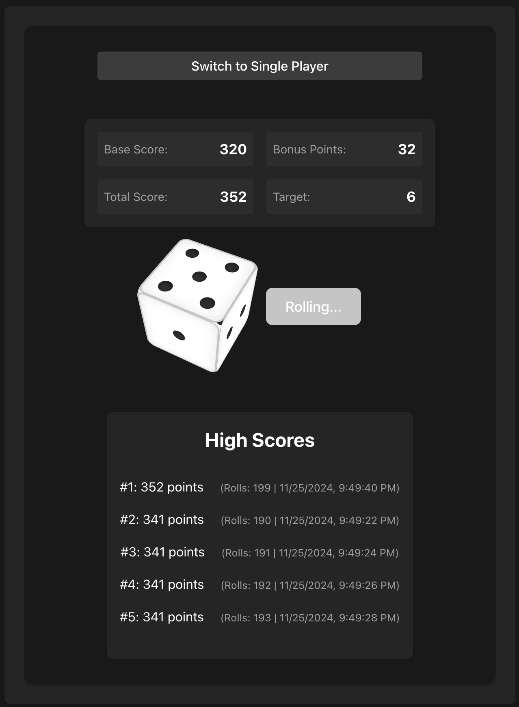

# Svelte Dice Game Alpha

A fun and interactive dice rolling game built with Svelte where players aim to match target numbers and compete for high scores. The game features both single-player and computer opponent modes, with a dynamic scoring system and persistent high scores.



## Gameplay

### Game Modes

- **Single Player**: Test your luck against the target numbers
- **VS Computer**: Compete against a computer opponent

### How to Play

1. Roll the dice by clicking the "Roll Dice" button
2. Match the target number to earn 10 points
3. Earn bonus points (10% of your current score)
4. Try to achieve the highest score with the fewest rolls
5. Your high scores are saved automatically

### Features

- Interactive 3D dice rolling animation
- Real-time score tracking
- Bonus points system
- High score leaderboard
- Roll history tracking
- Dynamic target numbers
- Computer opponent AI

## Technical Implementation

### Component Structure

- `App.svelte`: Main application container
- `Game.svelte`: Core game logic and layout
- `Dice.svelte`: Interactive dice component with rolling animation
- `HighScores.svelte`: High score display and management
- `ComputerPlayer.svelte`: AI opponent logic
- `Counter.svelte`: Score display component

### State Management

The game uses Svelte's built-in store system for state management:

- `stores.js`: Central state management
     - `score`: Current game score
     - `rollHistory`: Track of all dice rolls
     - `highScores`: Persistent high scores
     - `bonusPoints`: Calculated bonus points (10% of current score)
     - `totalScore`: Combined score with bonus points
     - `gameMode`: Current game mode (single/vs computer)
     - `target`: Current target number to match

### Key Features Implementation

- **Score System**: Points are awarded for matching target numbers (10 points) plus bonus points
- **High Score Management**: Automatically updates and maintains top scores
- **Roll History**: Tracks every dice roll with timestamps
- **Computer AI**: Implements strategic dice rolling for the computer opponent
- **Responsive Design**: Adapts to different screen sizes

## Getting Started

### Prerequisites

- Node.js (v14 or higher)
- npm or yarn

### Installation

```bash
# Clone the repository
git clone [your-repo-url]

# Install dependencies
npm install

# Start development server
npm run dev

# Build for production
npm run build
```

## Built With

- [Svelte](https://svelte.dev/) - Frontend framework
- [Vite](https://vitejs.dev/) - Build tool
- CSS3 for styling
- JavaScript ES6+

## License

This project is open source and available under the MIT License.
